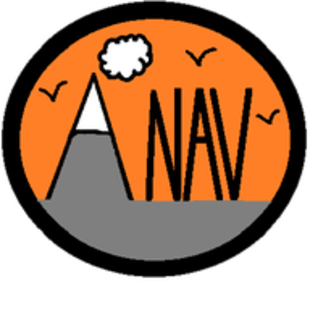
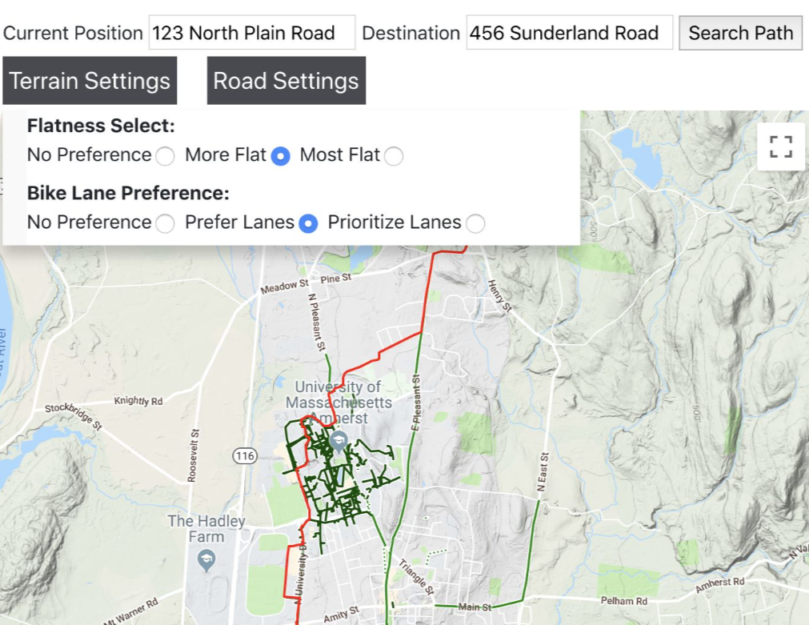
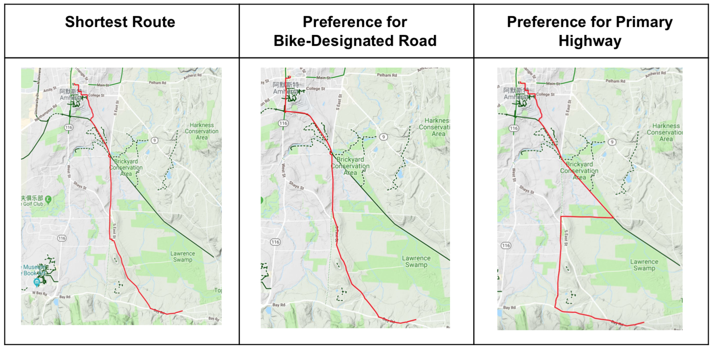
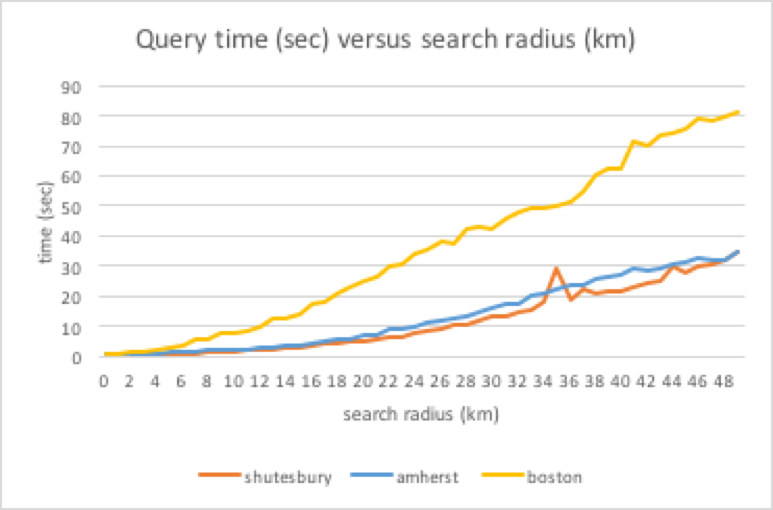

 

# ANAV: Custom Navigation for Cyclists with Tired Legs
ANAV is a web application that provides users with customizable routes based on user preferences for road type, gradient, and the presence of bike lanes. Originally deployed on a GCP instance, ANAV was developed as a class final project and is unfortunately no longer online. See the full writeup [here](docs/ANAV.pdf).

## Web Application
ANAV is served by a Flask API, and provides an embedded map via the Google Maps API, search autocomplete, and reverse geocoding via the [Nominatim API](https://nominatim.org).

 

## Data
ANAV uses preprocessed mapping data from [OpenStreetMap](https://www.openstreetmap.org) integrated with elevation data from the [Google Elevation API](https://developers.google.com/maps/documentation/elevation/start), transformed for efficient routing and ingested into a Postgres database. 

## Routing Algorithm
ANAV uses the [A\*](https://en.wikipedia.org/wiki/A*_search_algorithm) search algorithm, where edges are adjusted to reflect user preferences. Edge weights are adjusted based on the magnitude of user preferences, and have been fine-tuned with extensive user-testing.

 

## Performance Optimizations
Various preprocessing and performance optimizations allowed ANAV to support routing within the entire state of Massachussets with reasonable search times for typical biking routes. Geospatial data is stored in a Postgres database with geospatial indexed nodes and edges for quick graph generation. A routing query will kick off the following steps:
1. Determine a search radius suitable for the user query
2. Get edges from the database within this search radius
3. Generate an adjacency list 
4. Run routing algorithm
5. Return the route, and render it in an embedded map

The following graph shows the query latency achieved by ANAV running on a pretty cheap GCP instance for three different levels of urbanicity (Amherst and Shutesbury are medium and small size towns respectively, located in Western Massachusetts).

 
